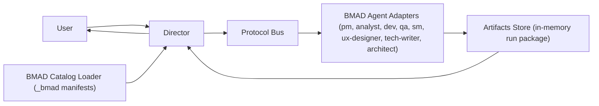

# High-Level Architecture

## Core Principles

- Director is the only user-facing interface.
- Agent roles come from BMAD manifests, not custom role implementations.
- Team composition and workflows are JSON-configurable.
- Protocol trace is explicit and auditable.
- System is independent from `microservice-ecp-service-manager` and treated as a new project.

## Suggested Production Stack

- API: FastAPI (Python) or NestJS (Node)
- Workflow orchestration: Temporal/Celery
- Event bus: NATS/Kafka
- Data store: PostgreSQL + Redis
- UI: React + TypeScript
- Observability: OpenTelemetry + Prometheus/Grafana
